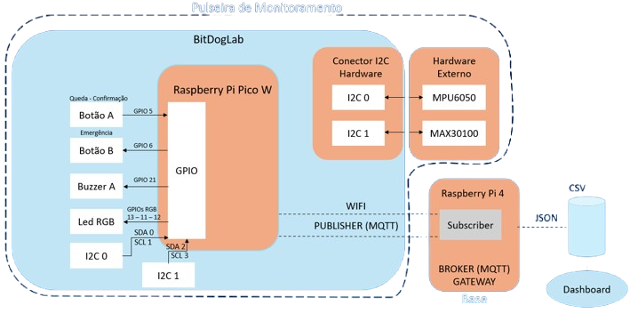

# 🩺 Sistema de Monitoramento Residencial com Raspberry Pi Pico W

## 📌 Objetivo

Este projeto foi desenvolvido como parte da **segunda fase do programa Embarcatech**, com o objetivo de validar os conhecimentos adquiridos em sistemas embarcados.

A proposta é criar uma solução para auxiliar pessoas que necessitam de **cuidados especiais em casa**, fornecendo um protótipo capaz de:

- 📉 **Detectar quedas** do paciente
- ❤️ **Medir batimentos cardíacos e SpO2** (oximetria)
- 📡 **Enviar dados em tempo real para a nuvem via MQTT**, permitindo que o médico responsável acompanhe o paciente
- 🔔 **Gerar notificações de emergência ou lembrete de hidratação**, de forma simples e acessível ao usuário

---

## ⚙️ Funcionamento

O sistema opera de forma contínua, coletando dados dos sensores e aguardando eventos:

- **Monitoramento contínuo:**

  - Mede batimentos cardíacos e SpO2 via sensor **MAX30102**
  - Captura dados de movimento e possíveis quedas via acelerômetro **MPU6050**
  - Envia as informações periodicamente para a nuvem via **MQTT**

- **Detecção de queda:**

  - Caso seja identificada uma queda, um **countdown de 10 segundos** é iniciado
  - Durante esse tempo, o **LED vermelho** acende
  - Se o paciente **pressionar o botão A**, o alerta é cancelado
  - Caso contrário, uma **notificação de emergência é enviada** e o sistema ativa o **buzzer** e faz o LED vermelho **piscar continuamente** até que o botão A seja pressionado

- **Botão de emergência (B):**

  - Ao ser pressionado, envia imediatamente uma **notificação de emergência** para o médico responsável

- **Lembrete de hidratação:**
  - Em intervalos configurados, o sistema aciona o **LED azul** e o **buzzer** para lembrar o paciente de beber água

---

## 🛠️ Componentes Utilizados

- **Raspberry Pi Pico W** (Wi-Fi integrado)
- **MAX30102** → Pinos **GP2 (I2C1 SDA)** e **GP3 (I2C1 SCL)**
- **MPU6050** → Pinos **GP0 (I2C0 SDA)** e **GP1 (I2C0 SCL)**
- **LED RGB:**
  - Vermelho → GP13
  - Verde → GP11
  - Azul → GP12
- **Botões:**
  - Botão A → GP5
  - Botão B → GP6
- **Buzzer passivo** → GP21

---

## 📐 Esquema Elétrico



---

## 📋 Instruções de Uso

O protótipo deve ser utilizado da seguinte forma:

1. Fixar os sensor MAX30102 no **dedo** e o MPU6050 no **pulso**
2. Deixar a **placa alimentada via USB ou bateria**
3. Garantir que a conexão Wi-Fi esteja configurada para envio de dados via MQTT
4. O paciente pode:
   - **Botão A:** cancelar falso positivo de queda ou parar alerta sonoro
   - **Botão B:** acionar emergência manual
5. O sistema automaticamente gera lembretes de hidratação e envia métricas médicas

---

## 💻 Como Reutilizar o Código

### Requisitos

- **VSCode** com a extensão oficial da Raspberry Pi Pico
- **CMake** e **Ninja** (já incluídos na extensão)
- **Pico SDK v2.1.1** (atenção à versão!)

### Passos

1. Clone este repositório:
   ```bash
   git clone https://github.com/EmbarcaTech-2025/projeto-final-felipe_vitor.git
   ```
2. Abra o diretório no **VSCode**.

   - Certifique-se de que a extensão da Raspberry Pi Pico esteja instalada.
   - O ambiente deve reconhecer automaticamente o `CMakeLists.txt` do projeto.

3. Conecte a Raspberry Pi Pico W em modo **BOOTSEL** (segurando o botão BOOTSEL ao plugar no USB).

4. Compile e faça o upload do projeto:

   - No **VSCode**, selecione o comando **Build Project**.
   - Após a compilação, escolha **Run Project** para enviar o binário à placa.

5. O código será gravado automaticamente na Pico W, e o sistema iniciará sua execução.

6. Siga o [passo a passo](https://github.com/EmbarcaTech-2025/projeto-final-felipe_vitor/tree/main/code/base_control/README.md) para configurar a base usando Raspberry Pi 4.

7. Siga o [passo a passo](https://github.com/EmbarcaTech-2025/projeto-final-felipe_vitor/tree/main/code/app/README.md) para configurar o aplicativo.

---

## 📸 Mídia

📷 Fotos e 🎥 vídeos de demonstração serão adicionados em breve.

- Vídeo de funcionamento (queda detectada, alerta de emergência e lembrete de hidratação)

---

## ✅ Resultados

O projeto demonstrou ser capaz de:

- Detectar quedas com precisão aceitável
- Monitorar batimentos cardíacos e SpO2 em tempo real
- Emitir notificações confiáveis em situações de emergência
- Auxiliar no cuidado domiciliar de pacientes que precisam de monitoramento constante

### Próximos Passos

- Melhorar a precisão dos sensores para uma detecção de quedas com algoritmos mais avançados e valores mais fidedignos de batimentos e oxigenação
- Otimizar a interface com o usuário
- Integrar aplicativo mobile para acompanhamento em tempo real
